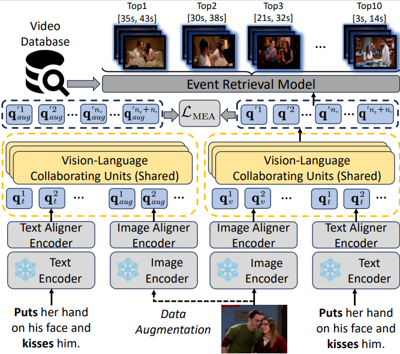
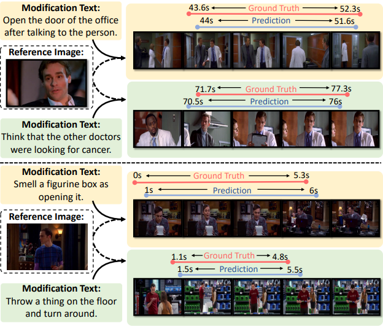

# Composed Query-Based Event Retrieval in Video Corpus with Multimodal Episodic Perceptron

PyTorch implementation for the paper "Composed Query-Based Event Retrieval in Video Corpus with Multimodal Episodic Perceptron"

[TVR-CQ Video Features](https://drive.google.com/file/d/1CxaRtdpWfhtpSdVkObaLf-n6GeJyfAd8/view?usp=drive_link)

We propose a novel event retrieval framework termed Composed Query-Based Event Retrieval (CQBER), simulating the multi-modal perception ability of humans to improve accuracy in the retrieval process. Specifically, we first construct two CQBER benchmark datasets, namely ActivityNet-CQ and TVR-CQ, which cover TV shows and open-world scenarios,respectively. Additionally, we propose an initial CQBER method, termed Multimodal Episodic Perceptron (MEP),which excavates complete query semantics from both observed static visual cues and various descriptions. Extensive experiments demonstrate that our proposed framework
significantly boosts event retrieval accuracy across different existing methods.

### Datasert Overview

<div style="display: flex; justify-content: center; flex-direction: column; align-items: center;">
    
    <p><strong>Figure 1: Supp. We compare our proposed TVR-CQ and ActivityNet-CQ datasets with original TVR and ActivityNet-Captions datasets in details.Perceptron</strong></p>
</div>

### Framework


<div style="display: flex; justify-content: center; flex-direction: column; align-items: center;">
    
    <p><strong>Figure 2: An overview of the CQBER framework based on our proposed Multimodal Episodic Perceptron</strong></p>
</div>


### Performance

<div style="display: flex; justify-content: center; flex-direction: column; align-items: center;">
    
    <p><strong>Figure 3: Supp. Additional ablation studies regarding the key model components on the TVR-CQ datasetPerceptron</strong></p>
</div>


### Visualization

<div style="display: flex; justify-content: center; flex-direction: column; align-items: center;">

    <p><strong>Figure 4: Visualizations of event retrieval results using our MEP
method on the TVR-CQ dataset </strong></p>
</div>


<div style="display: flex; justify-content: center; flex-direction: column; align-items: center;">
    
    <p><strong>Figure 5: Visualizations of episodic perception in composed
queries. Here we adopt the attention from the last VLCU layer. </strong></p>
</div>


<div style="display: flex; justify-content: center; flex-direction: column; align-items: center;">
    
    <p><strong>Figure 6: More visualizations of episodic perception and event retrieval results using our MEP method on the TVR-CQ dataset. </strong></p>
</div>

> The codes are modified from [ReLoCLNet](https://github.com/26hzhang/ReLoCLNet)

## Prerequisites

- python 3.x with pytorch (`1.7.0`), torchvision, transformers, tensorboard, tqdm, h5py, easydict
- cuda, cudnn

If you have [Anaconda](https://www.anaconda.com/distribution/) installed, the conda environment of ReLoCLNet can be
built as follows (take python 3.7 as an example):

```shell
conda create --name CQBER python=3.7
conda activate CQBER
conda install -c anaconda cudatoolkit cudnn  
conda install pytorch==1.7.0 torchvision==0.8.0 torchaudio==0.7.0 cudatoolkit=11.0 -c pytorch
conda install -c anaconda h5py=2.9.0
conda install -c conda-forge transformers tensorboard tqdm easydict
```

> The conda environment of [TVRetrieval](https://github.com/jayleicn/TVRetrieval) also works.

## Getting started

1. Clone this repository
2. Download features

For the features of TVR dataset, please download it from [features](https://drive.google.com/file/d/1CxaRtdpWfhtpSdVkObaLf-n6GeJyfAd8/view?usp=drive_link) and extrct it to the features
directory:

```shell
$ tar -xjf video_feats.tar.bz2 -C features 
```

This [link](https://medium.com/@acpanjan/download-google-drive-files-using-wget-3c2c025a8b99) may be useful for you to
directly download Google Drive files using `wget`.interested.

3. Add project root to `PYTHONPATH` (**Note that you need to do this each time you start a new session.**)

```shell
$ source setup.sh
```

## Training and Inference

**TVR dataset**

```shell
# train, refer `method_tvr/scripts/TVR_CQ_train.sh` and `method_tvr/config.py` more details about hyper-parameters
$ bash method_tvr/scripts/TVR_CQ_train.sh tvr video_sub_tef resnet_i3d --exp_id CQBER
# inference
# the model directory placed in method_tvr/results/tvr-video_sub_tef-CQBER-*
# change the MODEL_DIR_NAME as tvr-video_sub_tef-CQBER-*
# SPLIT_NAME: [val | test]
$ bash method_tvr/scripts/inference.sh MODEL_DIR_NAME SPLIT_NAME
```

## TODO

- Upload codes for ActivityNet Captions dataset
